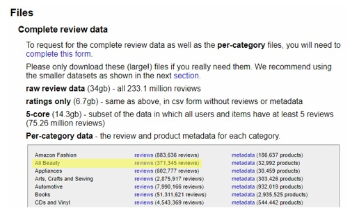
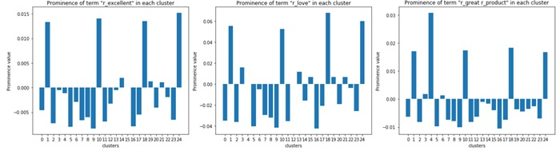
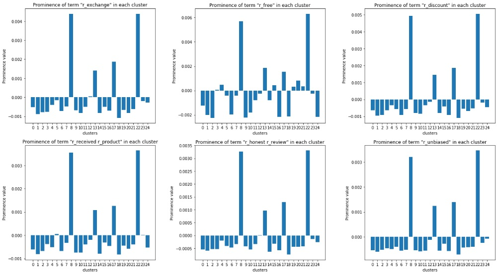
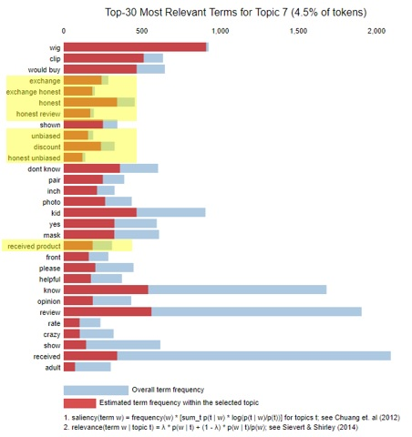

# Project: Detecting Fake Online Reviews

### Author: [Ali Eddeb](https://www.linkedin.com/in/ali-eddeb/)
 
### Date completed: March 29, 2020

This project was my capstone project from the Data Science Diploma Program I completed at BrainStation in Toronto. I have attached my jupyter notebooks which show all the detail in my work. The following text explains my overall approach and findings of this project. If you would like a quick reference of how the project is organized, please [click here](#quick-reference).

----

## Introduction
In today’s retail market, ecommerce has emerged as a major player. As of 2019, ecommerce has grown to own 16% of the USA’s total retail market 1. However, unlike brick and mortar shops, customers cannot assess products in person. For that reason, customers heavily rely on reviews and ratings when making online purchase decisions. 

With the reliance on ratings, businesses have prioritized making their products standout with good ratings in order to generate online sales. However, sources indicate that 10% to even up to 30% of reviews on Amazon, the largest ecommerce platform, are fake 2. This could be a result of businesses posting fake good reviews on their products in order to increase the rating. This is problematic because customers are making purchase decisions based on unreliable ratings. Thus, the goal of this project was to build a model that can detect fake reviews in order to help customers make more informed online purchase decisions.

######  1 https://www.digitalcommerce360.com/article/us-ecommerce-sales/
######  2 https://thehustle.co/amazon-fake-reviews

## Approach to the Problem
There are websites that provide grade reports for products reviews. Instead of categorizing reviews as fake or genuine, their approach involves grading reviews based on quality. Higher grades are given to products with mostly higher quality reviews. 

When I searched for publicly available Amazon review datasets, I immediately realized that no dataset has labels for reviews that mark them as fake or genuine. For that reason, I had to take a similar approach to the aforementioned websites because I cannot conclusively say that a review is fake or not. Instead, I could look at the features of a review and determine if it had qualities of a fake review. Some of these qualities include:
-	Extreme ratings
-	Grand claims and general terminology
-	Short reviews

Due to a lack of a target variable (ie. reviews labeled as fake or genuine), this problem was addressed using unsupervised learning, explained in more detail later.

## Dataset
I retrieved an Amazon review dataset from Jianmo Ni et al., UCSD 3. It contains reviews for products listed on Amazon.com from 29 categories from the year 1996 to 2018. The complete review dataset is rather large (34 GB). For that reason, I only used as small subset of the data to build models. Namely, I only used reviews from the beauty product category which contained approximately 370,000 reviews (highlighted below in yellow).

Please note that the dataset is not saved in this repo. You can access the data through the referenced link below.

###### 3 https://nijianmo.github.io/amazon/index.html

## Data Pre-processing
For a complete explanation of the **cleaning** steps that were performed, please refer to the jupyter notebook named *1_data_cleaning.ipynb*.

For **feature selection and engineering**, the following was performed:
-	extracted cyclical components of the date (month and day of week)
-	created new features:
    -	review and summary word counts
    -	reviewer behaviour: only gives 1-star or 5-star; posted multiple reviews
    -	Product popularity (based on number of reviews)

For an in-depth look into feature selection and engineering, please refer to the notebook named *2_feature_selection_and_engineering.ipynb*.

From the **EDA process**, some notable findings were:
-	The data is heavily skewed to 5-star reviews (high rating)
-	About 90% of products only have 1 review
-	The percentage of reviews associated with non-verified purchases decreased over the years

For an in-depth look into the EDA process, please refer to the notebook named *3_data_exploration.ipynb*.

## Modelling
After completing cleaning, feature selection/engineering and EDA, I went on to prepare the data for modelling. This involved ensuring that all features were in a numeric form. Notably, the text of the review and summary fields needed to be converted to numeric form. I utilized a TF IDF vectorizer to vectorize these two text fields. For reference, refer to *4_pre-modelling.ipynb*.

I ended up with approximately 1350 features after vectorizing the text fields. I decided to employ PCA in order to reduce dimensionality. After using PCA, I was able to achieve 83% cumulative explained variance from the first 350 principal components. KMeans clustering was then performed on these 350 principal components. I selected to fit the data on 25 clusters because it minimized the inertia value from the values tested (8 to 33 clusters). For reference, refer to *5_pca_and_modelling.ipynb*.

LDA Topic modelling was also performed in parallel to KMeans clustering but solely on the review text. This was done to provide a comparison framework between the most relevant tokens in the topics from the LDA model to the top tokens in the KMeans clusters. For reference on the LDA Topic Modelling process, refer to *6A_LDA_topic_modelling.ipynb*.

## Findings
In LDA topic modelling, 25 topics were generated from the review text. For the most part, the topics were quite clear. There were topics related to:
-	Specific types of products like shaving products, dental products and soaps
-	Logistics (e.g. shipping)
-	General positive sentiment (e.g. great product, recommend) 
-	General negative sentiment (e.g. waste of money, didn’t work)

If you are interested in looking at the topics in more detail, I have generated an interactive visualization of the topic models which you can access through the file *ldavis_prepared_25.html*. I recommend changing the relevance metric to 0.2 to get the most relevant terms within each topic. For reference on how the topics were generated, refer to *6A_LDA_topic_modelling.ipynb*.

As mentioned previously, fake reviews would generally use general terms and make grand claims. Through LDA topic modelling, there were several topics that do fit this description. This gives a good sense that there are possibly fake reviews within the corpus - this can be used to now compare with clusters found via KMeans clustering.

Through KMeans clustering, 25 clusters were generated and 2 clusters were identified (18 and 24) that had all the telltale signs of fake reviews. They had mostly 5-star ratings, low word counts, use of general positive terms and grand claims. For example, as shown in figure 1, clusters 24 and 18 are among clusters with the largest prominence values for the words excellent, love and great product. Here prominence means that these tokens were highly occurring in the reviews of these clustersa. 

###### a The prominence value was generated from: 1) TF IDF vectorization, 2)  applying PCA, 3) selecting the first 350 principal components (PCs) and 4) reconstructing values in original features from PCs after KMeans clustering was applied. 

 Figure 1. Prominence of the tokens excellent, love and great product within each cluster. 

 
The qualities of reviews from cluster 18 and 24 match the qualities of fake reviews that were described at the outset of this project. This gives a good indication that these clusters may contain fake reviews. Again, we cannot conclusively say that a review is fake or not. However, if a review fits into one of these clusters, we can flag it as potentially being a fake review. 

Additionally, another cluster presented a unique scenario. Cluster 22 contained reviews of people who may have been incentivized to give good reviews, evidenced by having the highest prominence values for tokens such as exchange, discount, free, honest review, and received product (figure 2). This does not necessarily mean these reviews are fake as the reviewers may have gave their honest opinion as evidenced by the tokens honest review and unbiased, but it indicates that they may be unreliable because the reveiwer may have been more inclined to give a good rating in exchange for receiving the product for free. 

 Figure 2. Prominence of the tokens exchange, free, discount, received product, honest review and unbiased within each cluster. 

 
In comparison to the LDA model, the LDA model also picked up in this cluster of incentivized reviews as evidenced by topic 7. Some of the most relevant terms in topic 7 included exchange, discount, received product and honest review (figure 3).

 Figure 3. Most relevant terms in topic 7 from the LDA model. 

 
In **conclusion**, we can summarize the findings as follows:
- Clusters 24 and 18 have the most telltale features of fake reviews (5 stars, low word count, use of general positive terms)
- This was not yet mentioned but the key difference between clusters 24 and 18 is reviewer behaviour. Reviewers in cluster 24 post more than 1 review where as in 18, they have only posted 1 review. This may indicate that some fake reviewers review multiple products where as in other cases, reviewers use different accounts perhaps to review the same product.
- Cluster 22 contains reviews of people who may have been incentivized to give reviews; this does not necessarily mean the reviews are fake as they could have been giving their honest opinion but they may be unreliable as the individual may be more inclined to give a good rating in exchange for receiving the product for free

## Next Steps
In terms of next steps, there are improvements that can be made to the KMeans model, such as:
-	Adjust preprocessing steps (namely feature engineering, tokenization and dimensionality reduction) 
-	Deal with class imbalances that exist in the data
-	Use more data from the total dataset
-	Experiment with other clustering methods

The potential utility of having such a model is to create a web application that generates grade reports for online product reviews similar to the websites fakespot.com and reviewmeta.com. For example, a customer could copy and paste a url of a product of interest into the web app. The web app would then grab all the reviews for that product and grade them based on what cluster they fall into. If reviews fall into one of the clusters of potentially fake reviews, then the grade for the product would decrease. The customer would then be able to discern, based on the final grade, if the reviews for their product of interest are reliable or not.

---

## Quick Reference

### Dataset
The data I used for this project is available at https://nijianmo.github.io/amazon/index.html. Specifically, I used the reviews from the All_beauty category.

### Jupyter Notebooks
My notebooks are organized chronologically by number. You can read the report, above, for an overview of the project. If you would like to look at specific details, they are contained in the jupyter notebooks.

### Scripts
I have a python script file named 'functions_library.py'. This file contains many custom functions that I needed to reuse throughout the project.

### Models
I included the 2 models from my project which are saved as pkl files within the folder 'Models'. The KMeans model is named 'kmeans_model25.pkl'. The LDA model is named 'lda_25.pkl'.

### LDA Visualization
I also included a visualization based on the LDA model. It can be viewed by accessing the 'ldavis_prepared_25.html' file.

### References
- https://sanjayasubedi.com.np/nlp/nlp-with-python-document-clustering/
- https://medium.com/@dmitriy.kavyazin/principal-component-analysis-and-k-means-clustering-to-visualize-a-high-dimensional-dataset-577b2a7a5fe2
- https://pandas.pydata.org/pandas-docs/stable/user_guide/groupby.html#aggregation
- https://towardsdatascience.com/end-to-end-topic-modeling-in-python-latent-dirichlet-allocation-lda-35ce4ed6b3e0
- https://github.com/kapadias/mediumposts/blob/master/nlp/published_notebooks/Introduction%20to%20Topic%20Modeling.ipynb

---

<strong>Thank you for taking the time to look at my project. If you have any comments, feedback or suggestions, please reach out to me. I am also open to collaborating on interesting ML projects. Again, please reach out if you would like to collaborate.</strong>

#### My contact Info:
<strong>email: ali.eddeb@gmail.com  
linkedIn: www.linkedin.com/in/ali-eddeb </strong>